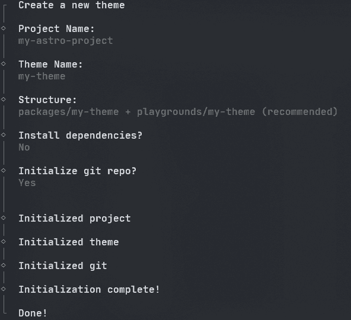
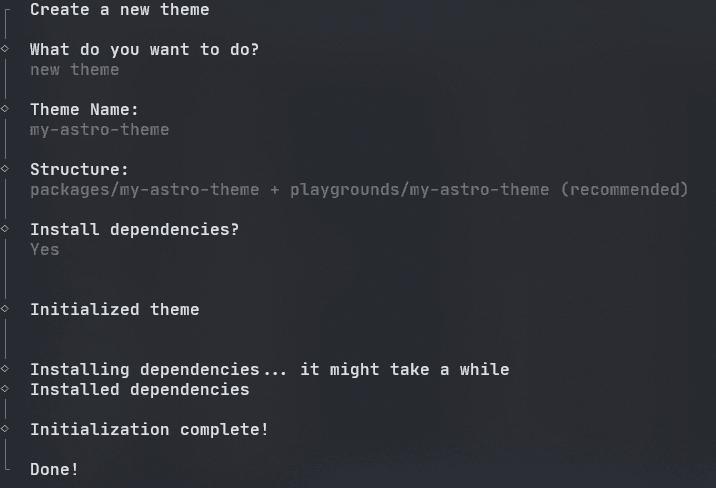

# create-astro-theme

## Create new theme

```bash
pnpm create astro-theme@latest
```

- create new project with new theme



- create new theme in existing project




## Create new project with existing theme

```bash
pnpm create astro-theme@latest with-theme theme-name
```

